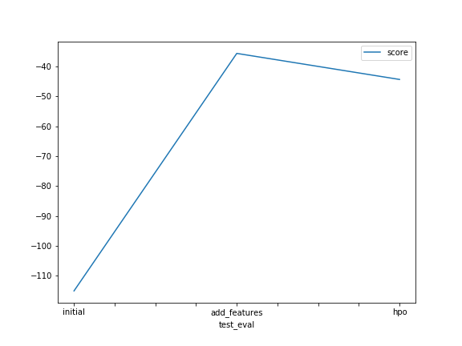

# Report: Predict Bike Sharing Demand with AutoGluon Solution

#### Teofilo Chichume

### Initial Training
## What did you realize when you tried to submit your predictions? What changes were needed to the output of the predictor to submit your results?
TODO: On submiting the prediction we realized that predictions has  negative values for RMSE score. Because kaggle will reject the prediction if we don't set everything to be greater than 0. we took the count on how many negative scores predictor returned and then we set all the negative predictions to 0. Finally we assign those predictions to submission dataframe.

### What was the top ranked model that performed?
TODO: Top ranking model was  WeightedEnsemble_L3.

### Exploratory data analysis and feature creation
## What did the exploratory analysis find and how did you add additional features?
TODO: From EDA I noted two main observation:
We realize that  'season' and 'weather' features clearly represent categorical data distribution with distinct values whereas rest of the other features represents contiguous data distribution exept 'workday' and 'holiday' which represents binay data distribution. Given that we can map 'season' and 'weather' features to categorical dtype.

we also realise that the  datetime column which can be splitted into 'year', 'month', 'day', 'hour' and 'weekday' features and removed the original 'datetime' feature column. the split could improve the model performance.

### How much better did your model preform after adding additional features and why do you think that is?
TODO: Model significantly performed better after adding the additional features. RMSE score reduced from 1.39369 to 0.46453. That's close to 66% improvement.

### Hyper parameter tuning
## How much better did your model preform after trying different hyper parameters?
TODO: Model performance slightly degraded after trying different hyper parameters.Kaggle score on test data increased from 0.48 to 0.56829  approximately.

If you were given more time with this dataset, where do you think you would spend more time?
TODO: I would spend more time doing feature engineering and Evaluating different model algorithms and hyperparameters tunning.

### Create a table with the models you ran, the hyperparameters modified, and the kaggle score.

nn_options = {  
    'num_epochs': 10,  
    'learning_rate': ag.space.Real(1e-4, 1e-2, default=5e-4, log=True),  
    'activation': ag.space.Categorical('relu', 'softrelu', 'tanh'),  
    'layers': ag.space.Categorical([100], [1000], [200, 100], [300, 200, 100]),  
    'dropout_prob': ag.space.Real(0.0, 0.5, default=0.1), 
}

gbm_options = { 
    'num_boost_round': 100,  
    'num_leaves': ag.space.Int(lower=26, upper=66, default=36),  
}

### Create a line plot showing the top model score for the three (or more) training runs during the project.
TODO: Replace the image below with your own.

### Create a line plot showing the top kaggle score for the three (or more) prediction submissions during the project.
TODO: Replace the image below with your own.

## Summary
TODO: In this case study we build the regression model to predict the bike demand given the bike sharing historical data. We first analyzed the features, plotting sample rows and using pandas describe method. Then we build initial first model with default parameters. 

We next performed EDA and analyze data pattern in features, where we changed the  dtype from numeric to categorical for season and weather, added new features to capture time element information for each record.

we also tuned model algorithm by . We se choose  GBM (tree based model) and deep neural network with different hyperparameter settings, but dident get the  model any better. 

